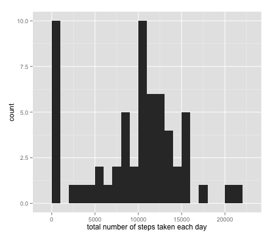
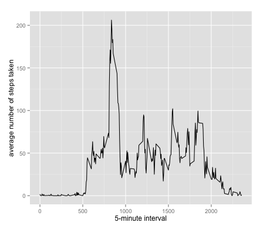
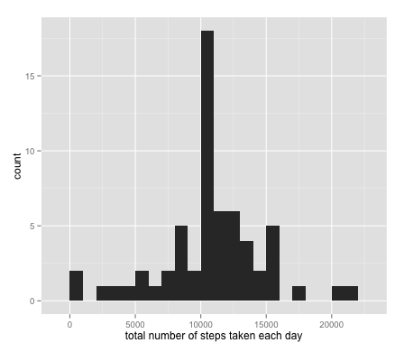
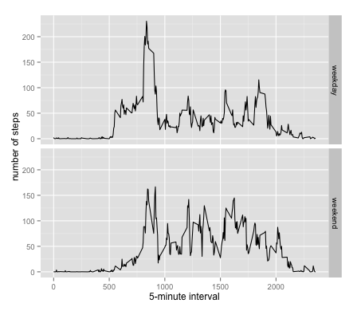

# Reproducible Research: Peer Assessment 1

## Loading and preprocessing the data

```r
setwd("/Users/jessefish/coursera/RepData_PeerAssessment1")
unzip(zipfile = "activity.zip")
data <- read.csv("activity.csv")
```
## What is mean total number of steps taken per day?

```r
library(ggplot2)
total.steps <- tapply(data$steps, data$date, FUN = sum, na.rm = TRUE)
qplot(total.steps, binwidth = 1000, xlab = "total number of steps taken each day")
```
We first create our histogram:

 

Now let's see the mean and median:

```r
mean(total.steps, na.rm = TRUE)
```

```
## [1] 9354
```

```r
median(total.steps, na.rm = TRUE)
```

```
## [1] 10395
```

## What is the average daily activity pattern?

```r
library(ggplot2)
averages <- aggregate(x = list(steps = data$steps),by = list(interval = data$interva), FUN = mean, na.rm = TRUE)
ggplot(data = averages, aes(x = interval, y = steps)) + geom_line() + xlab("5-minute interval") + ylab("avg daily activity pattern")
```

 


Which 5-minute interval, on average across all the days in the dataset, contains the maximum number of steps?

```r
averages[which.max(averages$steps), ]
```

```
##     interval steps
## 104      835 206.2
```

## Imputing missing values

There are many days/intervals where there are missing values (coded as `NA`). The presence of missing days may introduce bias into some calculations or summaries of the data.


```r
missing <- is.na(data$steps)
# Total number of missing values in the dataset
table(missing)
```

```
## missing
## FALSE  TRUE 
## 15264  2304
```

One method to fill 'NA' values - missing values - within the dataset is to fill them in with the mean for the given interval. 

```r

# Each missing value is replaced with the mean value

fill.value <- function(steps, interval) {
    filled <- NA
    if (!is.na(steps)) 
        filled <- c(steps) 
    else filled <- (averages[averages$interval == interval, "steps"])
    return(filled)
}

filled.data <- data
filled.data$steps <- mapply(fill.value, filled.data$steps, filled.data$interval)
```

```r
total.steps <- tapply(filled.data$steps, filled.data$date, FUN = sum)
qplot(total.steps, binwidth = 1000, xlab = "total count of steps taken each day")
```
We can now create a historgram. 

 

And also show the mean and median total number of steps taken per day. 

```r
mean(total.steps)
```

```
## [1] 10766
```

```r
median(total.steps)
```

```
## [1] 10766
```

Do these values differ from the estimates from the first part of the assignment? 

Yes. Mean and median values are higher now. 

What is the impact of imputing missing data on the estimates of the total daily number of steps?

The reason for the mean and median being higher is because we are using the mean value (for a given interval) for all missing data. When NA is evaluated with the original dataset, it is interpreted as 0. 

## Are there differences in activity patterns between weekdays and weekends?

Create a new factor variable in the dataset with two levels – “weekday” and “weekend” indicating whether a given date is a weekday or weekend day.

```r
weekday.or.weekend <- function(date) {
    day <- weekdays(date)
    
    if (day %in% c("Monday","Tuesday","Wednesday","Thursday","Friday")) 
        return("weekday") 
    else if (day %in% c("Saturday","Sunday")) 
        return("weekend") 
    else stop("invalid")
}

filled.data$date <- as.Date(filled.data$date)
filled.data$day <- sapply(filled.data$date, FUN = weekday.or.weekend)
```

Make a panel plot containing a time series plot (i.e. type = "l") of the 5-minute interval (x-axis) and the average number of steps taken, averaged across all weekday days or weekend days (y-axis).

```r
averages <- aggregate(steps ~ interval + day, data = filled.data, mean)
ggplot(averages, aes(interval, steps)) + geom_line() + facet_grid(day ~ .) +  xlab("5-minute interval") + ylab("count of steps")
```

 
